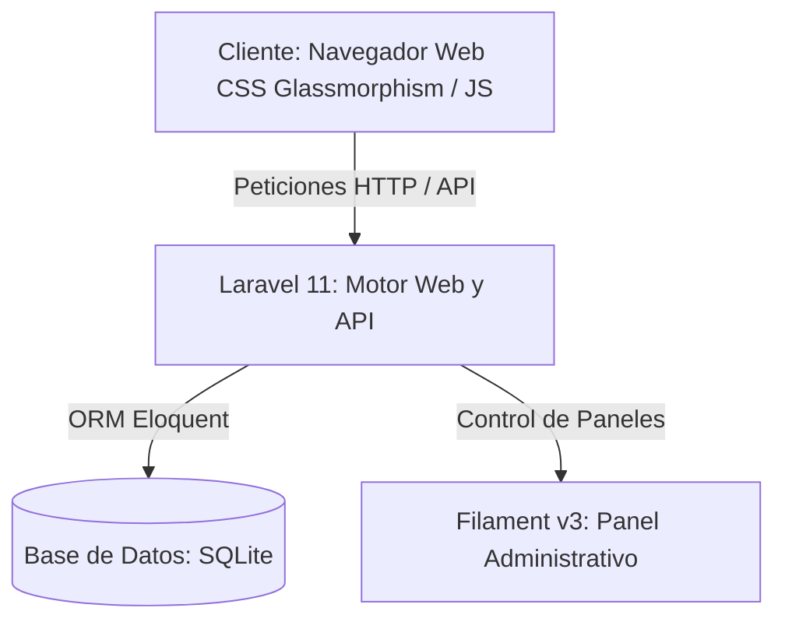

# Jardines de Allende Hidalgo - Sistema de Administración de Condominios

Este proyecto es una plataforma web completa de administración condominal desarrollada para **Jardines de Allende Hidalgo**. Integra una interfaz frontend interactiva de alto rendimiento con un panel administrativo robusto impulsado por Laravel y Filament.

---

## 📋 Descripción del Proyecto

La aplicación está diseñada para digitalizar, automatizar y transparentar la administración interna del condominio, con especial enfoque en el cobro de cuotas fijas mensuales de mantenimiento, cargos fijos y excedentes trimestrales por lectura de agua, generación de estados de cuenta históricos y el registro de abonos bancarios.

---

## 🎯 ¿A quién está destinada?

1. **Administradores del Condominio**:
   - Encargados de gestionar el censo de propietarios y roles.
   - Responsables de la captura trimestral de lecturas de agua.
   - Facultados para registrar cargos manuales (multas, cuotas extraordinarias) y abonos (transferencias, depósitos).
   - Encargados de importar abonos bancarios de forma masiva desde plantillas Excel.

2. **Condóminos (Propietarios e Inquilinos)**:
   - Usuarios finales que requieren visualizar la salud financiera de su cuenta en tiempo real.
   - Residentes que necesitan descargar su Estado de Cuenta Anual detallado en formato PDF.
   - Condóminos que buscan registrarse en la plataforma y asociarse de manera directa a su unidad correspondiente.

---

## 🚀 Funciones Principales

- **Landing Page Pública**: Presentación elegante del condominio con opciones directas de registro de condóminos y acceso al área del cliente.
- **Dashboard Interactivo SPA**: Panel de control con diseño *glassmorphism* oscuro, gráficos financieros en tiempo real (Chart.js), vista agrupada por torres (Torres 1, 2 y 3) y fichas de contacto detalladas.
- **Control de Roles Integrado (RBAC)**:
  - **Administrador**: Control total de lectura, creación, edición y borrado de todos los recursos.
  - **Condómino**: Acceso exclusivo a los datos y transacciones correspondientes a su propiedad vinculada (modo de solo lectura).
- **Cálculo Automatizado de Agua**: Sistema dinámico para ingresar lecturas iniciales y finales, calcular consumo total, aplicar precio por $m^3$ excedente y registrar el cargo automático.
- **Exportación de Reportes**:
  - Descarga directa de Estados de Cuenta Anuales formateados en PDF directamente desde el ledger.
  - Exportación de reportes históricos de ingresos filtrados por destino del dinero a planillas de Microsoft Excel.
- **Importador de Archivos Excel**: Interfaz drag-and-drop para cargar lotes de transacciones históricas validando integridad de datos antes de impactar en la base de datos.

---

## 🛠️ Arquitectura del Sistema

La arquitectura está construida bajo los estándares del desarrollo web moderno con PHP y JS:



- **Frontend**: SPA basada en HTML5, CSS vanilla con diseño premium adaptable y Javascript asíncrono interactuando con la API mediante `Fetch`.
- **Backend**: Laravel 11 como framework de servicios, sirviendo tanto las vistas Blade como las API de sincronización.
- **Base de Datos**: SQLite, ofreciendo portabilidad y cero latencia para entornos de administración local.
- **Panel Administrativo (Backoffice)**: Filament PHP v3 con soporte nativo para Livewire, Tailwind CSS, y Alpine.js.

---

## 🗄️ Diseño de la Base de Datos

La estructura relacional consta de las siguientes tablas principales:

```
  +-------------------+        1 : N        +-------------------+
  |    departments    |<--------------------|   transactions    |
  +-------------------+                     +-------------------+
  | PK id (string)    |                     | PK id (string)    |
  | torre             |                     | FK department_id  |
  | tipo              |                     | fecha             |
  | numero            |                     | tipo              |
  | contacto_nombre   |                     | concepto          |
  | contacto_rol      |                     | mes_correspondiente|
  | contacto_email    |                     | destino_abono     |
  | contacto_celular  |                     | monto             |
  | notas             |                     +-------------------+
  | status            |
  +-------------------+
            ^
            | 1 : N
            |
  +-------------------+
  |   water_readings  |
  +-------------------+
  | PK id (string)    |
  | FK department_id  |
  | periodo           |
  | lectura_inicial   |
  | lectura_final     |
  | excedente         |
  | precio_por_m3     |
  | monto_cobrado     |
  +-------------------+
```

- **`users`**: Administra las credenciales del sistema, clasificando a los usuarios por `role` (`admin`, `condomino`) y asociando los condóminos a su `department_id`.
- **`departments`**: Censo base de los 60 departamentos/locales comerciales en las 3 torres.
- **`transactions`**: Historial ledger con cargos de mantenimiento y cobros por abonos.
- **`water_readings`**: Bitácora trimestral de consumos de agua.
- **`audit_logs`**: Tabla de eventos de auditoría para registrar las acciones críticas sobre las finanzas.

---

## 🔮 Proyecciones de Desarrollo y Escalabilidad

Para llevar este sistema al siguiente nivel, se proponen las siguientes fases de desarrollo:

### 1. Migración a Infraestructura y Servidores más Sólidos
- **Base de Datos de Producción**: Migrar el motor local SQLite a **PostgreSQL** o **MySQL (AWS RDS / GCP Cloud SQL)** para soportar transacciones concurrentes con alta disponibilidad.
- **Contenerización y Orquestación**: Empaquetar la aplicación en contenedores **Docker** y desplegar usando **Kubernetes** o servicios administrados como **AWS ECS / GCP Cloud Run** para autoescalado dinámico.
- **Almacenamiento de Archivos (S3)**: Implementar almacenamiento en la nube (ej. **AWS S3**) para resguardar copias de seguridad de bases de datos y archivos PDF de estados de cuenta emitidos.

### 2. Proyección y Localización Internacional
- **Soporte Multi-Idioma (i18n)**: Implementar internacionalización para ofrecer la plataforma en múltiples idiomas (Español, Inglés, etc.).
- **Soporte Multi-Moneda (m10n)**: Habilitar facturación y cobro en divisas extranjeras, integrando convertidores de divisas en tiempo real.
- **Adaptación Fiscal**: Configurar perfiles impositivos y reglas fiscales parametrizables según la región o país (IVA, ISR, etc.).

### 3. Desarrollo de Aplicaciones Relacionadas (Ecosistema Condominal)
- **App Móvil para Condóminos**: Aplicación móvil (React Native / Flutter) que permita a los residentes:
  - Recibir notificaciones push de avisos y cargos.
  - Subir capturas de pantalla de comprobantes de pago bancarios directamente con la cámara del celular.
  - Participar en votaciones de asambleas generales de manera remota.
- **Módulo de Reservación de Amenidades**: Agenda interactiva para que los residentes aparten áreas comunes (terrazas, asadores, salones de eventos) aplicando cobros automatizados a sus estados de cuenta.
- **Control de Accesos QR**: Generación de códigos QR temporales desde la app del condómino para el ingreso controlado de visitantes y proveedores en la caseta de seguridad.
- **Integración con Medidores Inteligentes (IoT)**: Sincronización directa mediante API con medidores de agua de telemetría IoT para automatizar la captura de lecturas mensuales sin necesidad de recolección manual.
